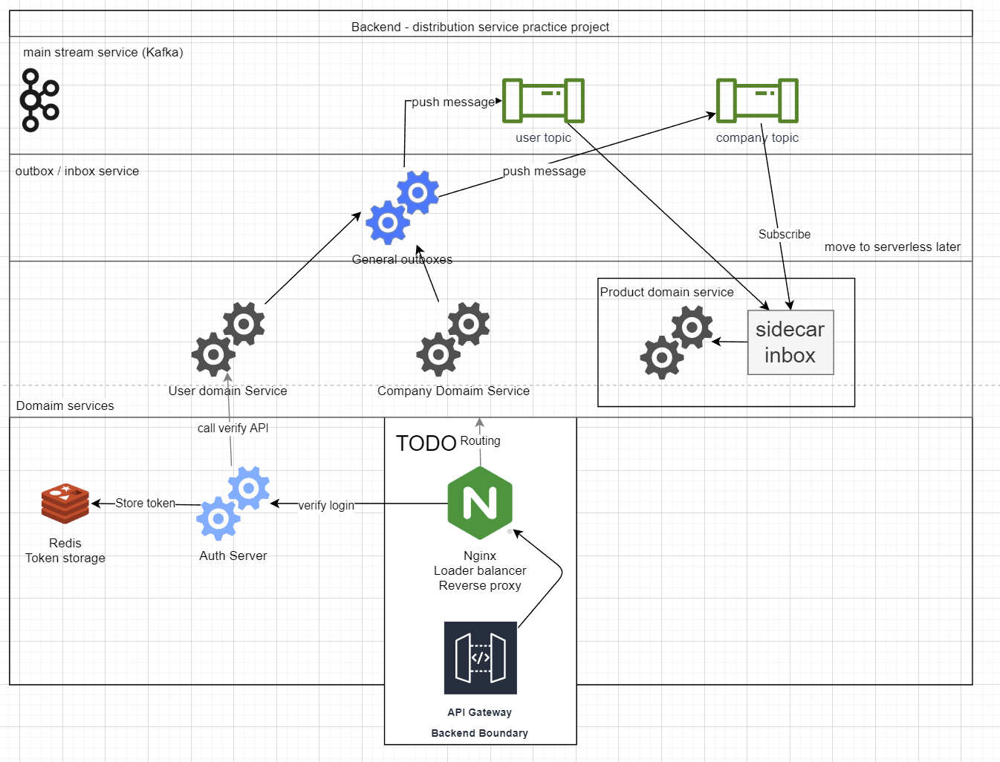

# micro-service-infra

## Related Projects
this project is infra for distributed-system-pratice-project, the Related projects including:

- [Product Domain](https://github.com/sean0427/micro-service-pratice-product-domain)
- [Company Domain](https://github.com/sean0427/company-domain-distributed-system-p)
- [User Domain](https://github.com/sean0427/micro-service-pratice-user-domain)
- [Authentication Server](https://github.com/sean0427/micro-service-pratice-authentication-server)
- [General Outbox Service](https://github.com/sean0427/outbox-function-distributed-system-p)
- [General Tools / helpers](https://github.com/sean0427/tool-distributed-system-p)

## document
[Notion](https://sean810427.notion.site/Micro-Service-d5da9f17db004a4d9508be42f306d1fd) (WIP)

## Secrets

all the secret using random password, you can find it on kubernetes secret.

## Diagram

[diagrams.drawio](./diagrams.drawio)